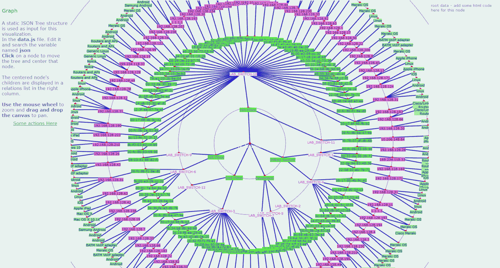

# data.js generator for Datavisualization with infovis

This script aims to generate a **data.js** file that is the javascript needed for render relation between objects thanks to the **infovis** javascript library.

This script aims to generate **data.js** to be uesed in the datavis project located here :

[2D_visualization_with_infovis project]('https://github.com/pcardotatgit/2D_visualization_with_infovis)'

## The goal

Let's set up a goal.

Our goal is to generate a 2D 360° interactive relation graph tree for the **csv**we have in the **datas** subfolder.

Have a look to this file. It contains network information.  It is an inventory of Endpoints connected to switchs within a network.

```
My_Network;Office Switch;LAB_SWITCH-1;00:fc:8b:83:69:98;192.168.128.26;Android;00:fc:8b:83:69:98
My_Network;Basement;LAB_SWITCH-2;dc:f3:03:e0:c4:b9;192.168.128.210;Windows 10;dc:f3:03:e0:c4:b9
My_Network;2nd Floor;LAB_SWITCH-3;ac:13:f4:70:3f:37;192.168.128.223;Apple iPad;ac:13:f4:70:3f:37
My_Network;Basement;LAB_SWITCH-2;00:fc:8b:2a:83:dd;192.168.128.190;Android;00:fc:8b:2a:83:dd
My_Network;Office Switch;LAB_SWITCH-4;00:17:88:4b:9c:42;192.168.128.31;Linux;00:17:88:4b:9c:42
```

We are going to display this file as the following graph




## The /datas/data.csv file format

Even if it is not obvious, this file describes a tree.

The first column contains a single information that is a network name. All cells contain the same value.

The second column contains **site names** that belong to this network. 

The third column contains a **switch names** of switches that belong to every **sites**.  Every sites contains several switches and this is the reasons why we have in the second column, several times in several rows the same site names. But for every of these row we mention in the third column a switch name.

The fourth column contains **Mac addresses** of endpoint that are connected to switches.

The fifth column contains the **ip addresses** that are attached to the mac addresses

The column number six contains the endpoint  operating system **OS**

So this files describes a tree and every branches of this tree can be described as the following path :

Network Name => Site => Switch => Mac Address => Ip Address => OS

You can understand now that if you want to add an additionnal row to the file. you just have to add a new line at the end of the file. A line that respect this above format with all item names. You don't have to take care of the order of the lines.

The **data.csv** file must be located into the **datas** folder

## installation

Create a working directory and open a CMD console / terminal into it.


## dependencies

You just have to install the **crayons** python module

```
    pip install crayons
```

## Run the script and get the result

1-  you must have a valid **data.csv** file into the **/datas** subfolder
2- from your working directory type :

```
    python 1-graph-it.py
```

The result will be to files located into the **/output** directory

- **data.js** : the expected result
- **z_var_json.json** : for debugging

The **/output** directory contains a html files named **graph.html** and all infovis resources located into the **/output/resources** subfolder.

After having running the script, you can check the result by opening the **graph.html** file with your browser.

The **graph.html** is an example of web page to display.

You can modify it as you wich and if you need to change background color or size, then edit the **/output/resources/css/base.css** file